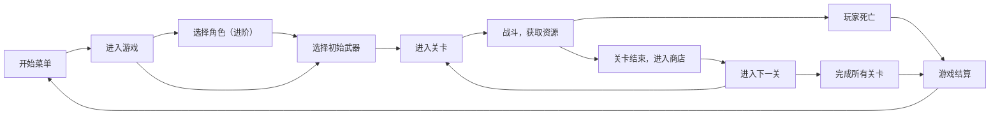

# 3D 类土豆兄弟开发

## 流程设计

## 开发需求
### 基础部分
#### UI 部分
- [x] 开始菜单 UI
- [ ] 局内 HUD
- [ ] 局内商店页面
- [ ] 设置页面

#### 游戏逻辑部分
- [ ] 玩家操作
- [ ] 玩家武器
   - [ ] 自动攻击
   - [ ] 等级制，多次获得同一把武器会升级
- [ ] 敌人：近战、远程……
- [ ] 关卡制，每关结束后进入商店购买武器和道具

### 进阶部分
- [ ] 武器词缀：每把高级武器会随机带有一个该等级的词缀，附带额外效果
- [ ] 多角色：每个角色初始属性不同，不同角色技能不同